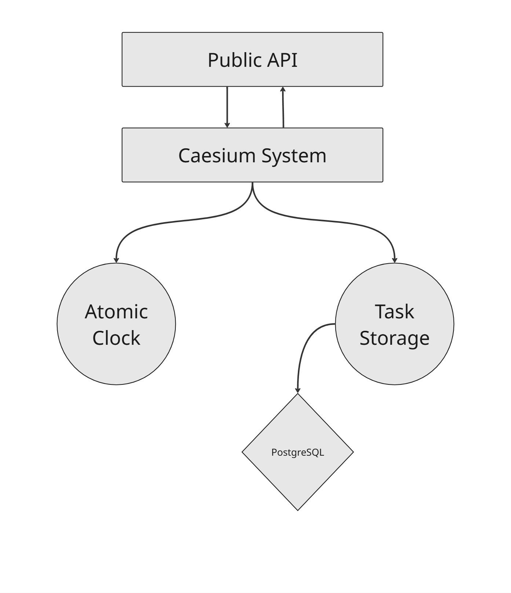

# Caesium

A lightweight task scheduler built with Spring Boot and Java 25. Tasks are registered with a trigger time, persisted to PostgreSQL, and executed via an atomic clock that ticks every second. Due tasks run in virtual threads.

## Architecture

- **`CaesiumSystem`** — core scheduler; registers tasks, drives the execution loop, detects missed tasks across day boundaries
- **`AtomicClock`** — dedicated thread that ticks at a configurable rate and invokes the scheduler's `step()` callback
- **`SqlStorage`** — PostgreSQL persistence via Spring Data JPA; queries today's tasks and marks completions
- **`CaesiumTask`** — abstract base class; subclass and implement `execute()` to define task behavior
- **`TaskFactory`** — reflection-based factory for instantiating task classes
- **`MainController`** — REST API (`GET /api/tasks`, `GET /api/tasks/collected`, `POST /api/tasks/complete/{id}`)

## Stack

- Java 25, Spring Boot 4.0.5, PostgreSQL, Maven, Lombok

## Configuration

Set your database connection in `src/main/resources/application.properties`. The server runs on port `9000` by default.

## Demo

`Main.java` registers two example `MyTask` instances (scheduled at +10s and +1m) to demonstrate the scheduling flow.
